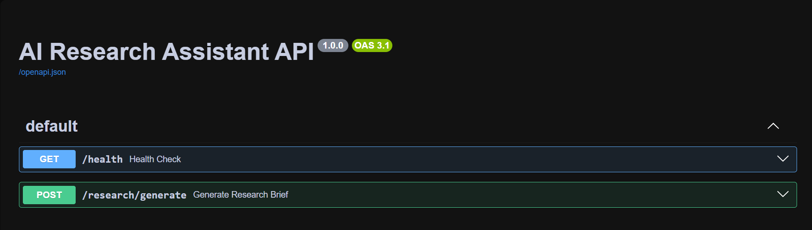
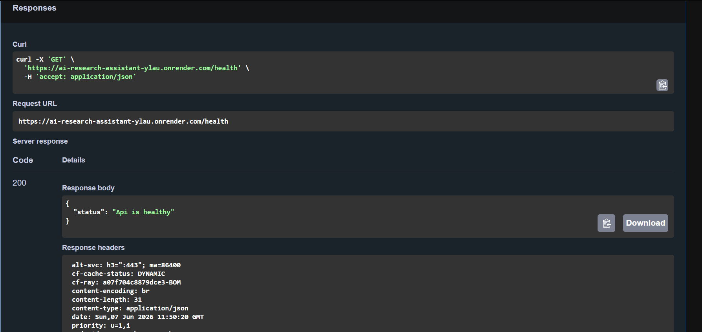
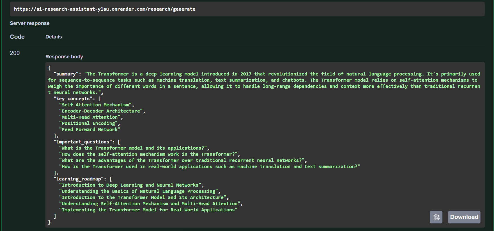

# AI Research Assistant API

## Overview

AI Research Assistant is a FastAPI-based backend application that helps users quickly explore and learn new topics using Large Language Models.

Instead of manually searching through multiple resources, users can provide a topic and receive a structured research brief containing:

* A concise summary
* Key concepts to understand
* Important questions for deeper learning
* A recommended learning roadmap

The project uses LangChain for orchestration and Groq's LLMs for generating responses while returning structured outputs through Pydantic schemas.

---


## Features

* Generate structured research briefs for any topic
* Beginner-friendly learning roadmap generation
* Key concept extraction
* Important question generation
* FastAPI REST API
* LangChain + Groq integration
* Structured responses using Pydantic
* Interactive Swagger documentation
* Environment-based configuration

---

## Tech Stack

### Backend

* Python
* FastAPI

### AI / LLM

* LangChain
* Groq

### Validation & Configuration

* Pydantic
* Python Dotenv

### Deployment

* Render

---

## Project Structure

```text
AI_RESEARCH_ASSISTANT
│
├── app
│   │
│   ├── routes
│   │   ├── health.py
│   │   └── research.py
│   │
│   ├── schemas
│   │   ├── research_request.py
│   │   └── research_response.py
│   │
│   ├── services
│   │   ├── groq_service.py
│   │   ├── prompt_builder.py
│   │   └── research_service.py
│   │
│   ├── utils
│   │   ├── config.py
│   │   └── logger.py
│   │
│   └── main.py
│
├── requirements.txt
├── .env
└── README.md
```

---

## API Endpoints

### Health Check

```http
GET /health
```

---

### Generate Research Brief

```http
POST /research/generate
```

Sample Response:

```json
{
  "summary": "...",
  "key_concepts": [
    "..."
  ],
  "important_questions": [
    "..."
  ],
  "learning_roadmap": [
    "..."
  ]
}
```

---

## Deployment

### Live API

https://ai-research-assistant-ylau.onrender.com

### Swagger Documentation

https://ai-research-assistant-ylau.onrender.com/docs

### Source Code

https://github.com/Aaryan-Nayan-Srivastava/ai_research_assistant

### Docker Repository

https://hub.docker.com/repository/docker/aaryannayansrivastava/ai-research-assistant

---

## Local Setup

### 1. Clone the Repository

```bash
git clone https://github.com/Aaryan-Nayan-Srivastava/ai_research_assistant.git

cd ai_research_assistant
```

---

### 2. Create a Virtual Environment

```bash
python -m venv venv
```

---

### 3. Activate the Virtual Environment

```bash
venv\Scripts\activate
```
---

### 4. Install Dependencies

```bash
pip install -r requirements.txt
```

---

### 5. Configure Environment Variables

Create a `.env` file in the project root:

```env
APP_NAME=AI Research Assistant API

LOG_LEVEL=INFO

GROQ_API_KEY=YOUR_GROQ_API_KEY

MODEL_NAME=llama-3.3-70b-versatile
```

---

### 6. Run the FastAPI Application

```bash
uvicorn app.main:app --reload
```

---

## Swagger UI

### Swagger Home



### Health Endpoint



### Research Endpoint


